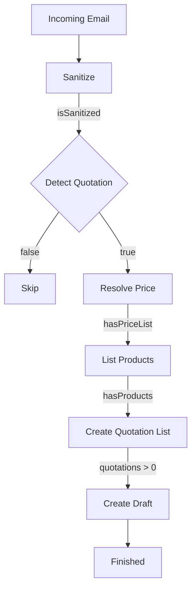

## Presentation Overview

**Title:** Automated Quotation Agent Logic and State Planner

**Presented by:** Max and Jeremy (MIA Innovation)

The presentation was hosted at a **2050-square-foot AI ecosystem hub** in Quebec, a collaborative space where multiple companies develop practical AI solutions for SMEs.

The presentation focused on a real-world business case for **Desdowd**, a manufacturer's agent specializing in electrical products.

### Objective

Demonstrate how **Goal-Oriented Action Planning (GOAP)** can replace manual quotation workflows with an intelligent agent capable of:

- Understanding customer requirements
- Searching technical catalogues
- Selecting appropriate products
- Generating quotation drafts automatically

---

# Project Overview

## Client

**Desdowd**

Manufacturer's agent for electrical products.

## Problem

The quotation process required employees to:

- Analyze large manufacturer catalogues
- Understand complex technical specifications
- Manually prepare quotations

This resulted in:

- Long processing times
- High risk of human error
- Difficult maintenance

## Solution

An AI agent that automatically:

1. Understands the customer's request
2. Finds matching products
3. Creates standardized quotation drafts

## Tech Stack

- KOOG
- Kotlin
- Java
- OpenAI
- Anthropic
- Spring
- Ktor

---

# Why GOAP?

The team compared several approaches.

## Traditional Algorithm

### Advantages

- Reliable
- Predictable

### Drawbacks

- Very rigid
- Every workflow must be hard-coded
- Difficult to evolve

---

## Autonomous LLM

### Advantages

- Extremely flexible

### Drawbacks

- Hallucinations
- Can forget steps
- Difficult to understand why decisions were made

---

## ReAct

### Advantages

- Dynamic reasoning (Reason → Act)

### Drawbacks

- LLM remains the only decision maker
- Risk of infinite loops

---

## GOAP

### Advantages

- Reliable
- Adaptive
- Typed actions
- Explicit preconditions
- Dynamic replanning

### Drawbacks

- Slightly more implementation work

---

> [!tip]
> GOAP computes the optimal sequence of actions using an **A\*** pathfinding algorithm.
>
> Each action has:
>
> - Preconditions
> - Beliefs (expected world state after execution)
> - Cost
>
> The planner searches for the **lowest-cost path** to reach the goal.

---

# Quote Mail Processor



---

# GOAP Components

## World State

The state represents everything the planner knows.

```kotlin
data class MyState(
    val step1Done: Boolean = false,
    val step2Done: Boolean = false,
    val goalReached: Boolean = false
)
```

---

## Action

Actions are completely independent.

They execute only if their **precondition** is satisfied.

After execution, the planner assumes the **belief** becomes true.

```kotlin
action(
    name = "Detect quotation intent",

    precondition = {
        state ->
        state.isSanitized &&
        state.isQuotationRequest == null
    },

    belief = {
        state ->
        state.copy(isQuotationRequest = true)
    }

) { ctx, state ->

    intentDetectorAgent.detectIntent(ctx, state)

}
```

---

## Goal

The planner searches for the cheapest sequence of actions that satisfies the goal.

```kotlin
goal(
    name = "Draft mail creation",

    condition = {
        state ->
        state.hasDraft
    }
)
```

---

# Performance

> [!success]
> **Average processing time**
>
> ~2 seconds

---

> [!success]
> **Cost**
>
> Optimized to only **fractions of a cent** per quotation.

---

# Security

## Sanitization

Before sending data to an LLM, the system removes:

- Personal Identifiable Information (PII)
- Sensitive customer data

---

## Privacy

The solution supports:

- Local LLMs
- On-premise deployment
- Sensitive data never leaves the customer's infrastructure

---

# Key Takeaways

- GOAP combines the reliability of traditional software with the flexibility of LLMs.
- Planning is deterministic while execution remains AI-driven.
- Every action has explicit preconditions and expected outcomes.
- The planner automatically recalculates the optimal path whenever the world state changes.
- The quotation system processes requests in approximately **2 seconds** while maintaining low operating costs and protecting sensitive customer information.
