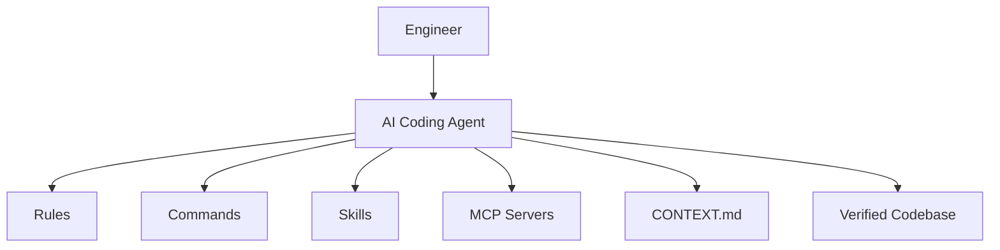
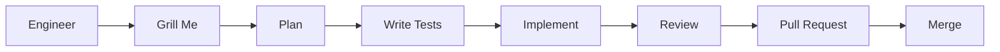

# From Vibe Coding to Vibe Engineering: Scaling AI-Assisted Development

## Presentation Overview

- **Speaker:** Matt Pocock
- **Company:** Independent consultant (formerly built custom software in San Francisco)
- **Problem:** AI dramatically accelerates code generation, but the bottleneck has shifted to understanding, validating, maintaining, and evolving code. Vague prompts often produce convincing but incorrect implementations.
- **Objective:** Move from **Vibe Coding** (asking AI to build software) to **Vibe Engineering** (using AI within disciplined engineering processes).
- **Technologies:** Claude Code, Cursor, Model Context Protocol (MCP), TypeScript, Shell

**Github Repo (Skills)**: https://github.com/mattpocock/skills/tree/main

---

## Architecture

High-quality AI-assisted development relies on layered configuration instead of increasingly complex prompts.



---

## Core Concepts

### Vibe Coding vs. Vibe Engineering

| Feature | Vibe Coding | Vibe Engineering |
| --- | --- | --- |
| **Input** | Vague prompts | Clear specifications |
| **Process** | Generate code | Plan → Test → Implement → Review |
| **Validation** | Manual inspection | Types, tests, reviews |
| **Result** | Technical debt | Maintainable software |

### Context Management

- Keep context usage below **40–50%**.
- Start a new conversation when switching features.
- Maintain a `CONTEXT.md` to define project terminology.
- Use handoff notes instead of continuing polluted conversations.

---

## Technical Implementation

### Project Structure

```text
.claude/
├── skills/
├── commands/
└── rules/

CONTEXT.md
ADRs/
```

### Installing Skills

```bash
npx skills@latest add mattpocock/skills
```

### TDD Workflow

```text
1. Inspect the existing code
2. Write a failing test
3. Implement the smallest change
4. Refactor
5. Verify
```

---

## Development Workflow



---

## Design Decisions

### Grill Me

Instead of generating code immediately, the agent asks clarifying questions until the requirements are fully understood.

**Benefits**

- Better specifications
- Fewer assumptions
- Less rework

### Vertical Slicing

Break large features into independently completable tasks.

**Benefits**

- Smaller contexts
- Easier reviews
- Better parallelization
- Reduced hallucinations

### Model Selection

- Frontier models → Planning
- Fast models → Execution

This balances latency, quality, and cost.

---

## Performance

- Shared terminology reduces token usage.
- Smaller contexts improve reliability.
- Reset conversations before context exceeds **50%**.
- Spending more time planning reduces implementation time later.

---

## Security

- Block destructive Git commands (`push`, `reset --hard`, `clean`).
- Never expose secrets or API keys.
- Validate all database writes.
- Enforce persistent rules instead of repeating prompts.
- Require human approval before merging.

---

## Ideas Worth Reusing

- Use a **"Grill Me"** workflow before implementation.
- Maintain a `CONTEXT.md` for shared project terminology.
- Treat rules and skills as version-controlled source code.
- Use handoff notes between conversations.
- Prefer many short AI sessions over one long conversation.
- Use TDD as the agent's primary feedback loop.

---

## Key Takeaways

- AI accelerates implementation, not engineering judgment.
- Better context is more valuable than more context.
- Planning should always precede coding.
- Small contexts produce more reliable results.
- Testing is the agent's primary source of feedback.
- Treat AI as another engineer on the team, not as an autocomplete tool.

---
## Memorable Quotes
> "Better context beats more context."
> "Planning is cheaper than debugging."
> "AI doesn't replace engineering—it amplifies it."
