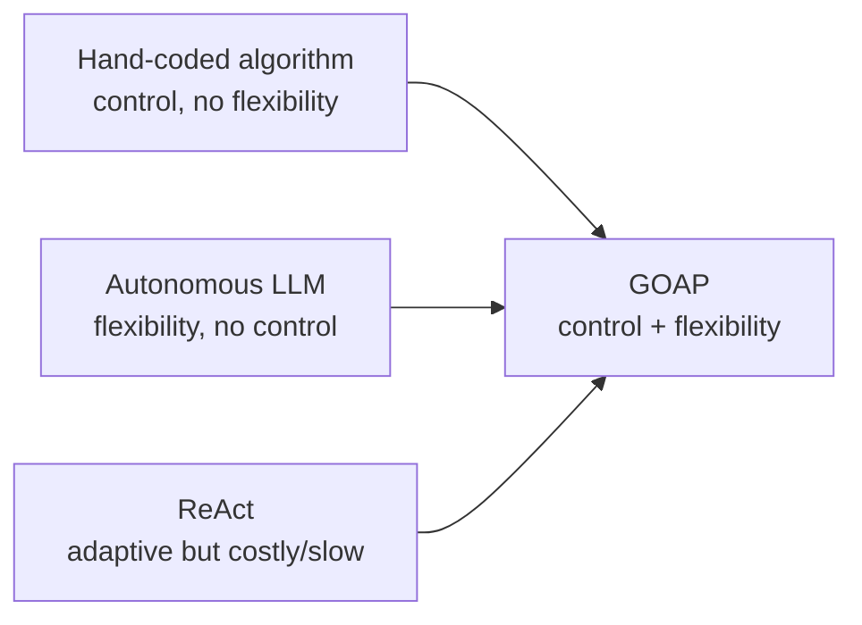
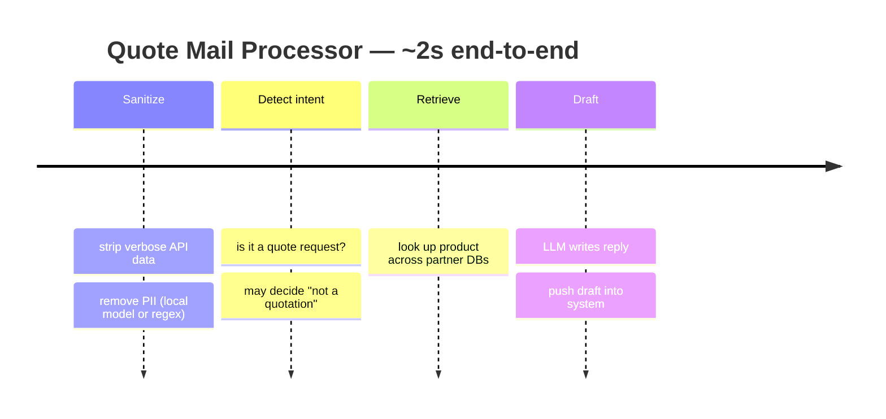

> [!abstract] TL;DR
> **GOAP (Goal-Oriented Action Planning)** brings game-AI planning to LLM agents: you declare a goal, a set of actions (each with a *precondition*, a *belief* about the resulting world-state, and a *cost*), and a planner figures out the cheapest valid sequence to reach the goal. The talk shows how to build this in **Koog**, JetBrains' open-source Kotlin/Java agent framework, and demos a real **Quote Mail Processor** agent.

> [!info] Why this matters
> GOAP keeps the **reliability/control of hand-coded algorithms** while keeping the **flexibility of an LLM** — without the cost and fragility of running a full ReAct reasoning loop on every step.

---

## 01 · Context — MIA Innovation & the hub

> [!info] Who's presenting
> **MIA Innovation** — AI specialists *"spécifiquement en sémantique"* for ~2 years, doing software development since **2019**. Focus: helping **Québec SMEs (PME québécoises)** become more productive with agents (slides list three pillars: **Intelligence Artificielle · Développement Web · Architecture Cloud**).

> [!note] The hub (speaker note)
> The talk was given in the **MIA Innovation hub** — a ~**2,050 sq ft** ecosystem of AI startups that share human/material resources and infrastructure. Other tenants work on **AI voice agents** and **AI animation**. The presenters stressed the field is "moving so fast" and they constantly adapt to new alternatives. The session ended with **networking**: attendees were invited to post problems/apps they wanted to discuss on a board.

### Case study — automating quotes ("la soumission")

> [!abstract] Client: **DesBond** *(slide logo reads "DESBOND"; the auto-transcript garbled it as "Desdowd")*
> *"Projet : Automatisation des soumissions par IA"* — built with their contact **Jérémy** after the usual **analysis phase** then full software dev/integration.

- **The problem (speaker):** quote/RFP handling ("la soumission") is a recurring SME bottleneck — a request arrives by email or tender platform and people generate the quote by hand.
- **DesBond's business:** an electrical-products broker/manufacturer. A client needing e.g. an **EV charging station ("borne électrique")** calls DesBond, who searches across **all their partner manufacturers'** databases to find the right part. Today **3–4 people analyze those databases manually**.
- **Solution:** an agent that receives the request, analyzes it, generates the response from the databases, and **auto-drafts the quote**.

---

## 02 · What is GOAP?

> [!quote] Definition (from slide)
> **Goal-Oriented Action Planning** — *« atteindre un objectif fixé en planifiant dynamiquement les étapes pour le réaliser. »*
> (Reach a fixed goal by **dynamically planning the steps** needed to achieve it.)

GOAP originates in game AI. Instead of scripting *how* the agent behaves, you describe the **goal** and the **available actions**, and a planner searches for a valid, low-cost path from the current world-state to the goal.

> [!tip] The key phrase (speaker)
> *"Planifier **dynamiquement**."* Unlike a fixed algorithm, if the **state of the world changes mid-execution**, the agent **recalculates** the most efficient path to the goal — it iterates and improves within its own planning loop.

---

## 03 · Why GOAP? — approaches compared

> [!warning] Reconstructed from a small, angled slide — wording approximate; verify against audio.

| Approach | Strengths | Weaknesses |
|---|---|---|
| **Algorithme** (hand-coded) | Reliable & predictable | Rigid — every step coded by hand; any change means rewriting the flow |
| **LLM autonome** | Very flexible | Unpredictable — can break rules, hallucinate, or go off-topic |
| **ReAct** (Reason→Act loop) | Adaptive via reason/act loop | Costly & slow at runtime; fragile |
| **GOAP** | Combines an algorithm's control with an LLM's flexibility | Reliable & structured yet adaptable, **without extra LLM cost except when useful** |



> [!quote] The spectrum, in the speaker's words
> - **Pure algorithm** — chain calls with conditions; great, but *"si la donnée change ou si le besoin évolue, on n'est pas très flexible."*
> - **Autonomous agent** (other end) — hand it the mail and say "go find the quote"; powerful, but *"on ne sait pas vraiment de manière déterminée comment il arrive au résultat"* (it's a black box).
> - **ReAct** — analyze the task, look at potential reactions, observe the output, redo if it's not good.
> - **GOAP (their choice)** — keep determinism *and* flexibility. Chosen via **Koog** specifically because it integrates cleanly with Kotlin/Spring/Ktor and uses **coroutines** (few blocking calls → fast).

---

## 04 · Koog — the framework

> [!info] KOOG (page 03/05)
> *Open-source framework dedicated to building AI agents in **Kotlin & Java**.* (by JetBrains)

- Supports the major LLMs on the market — **OpenAI, Anthropic, Google, Ollama…**
- Offers several **orchestration patterns**: functional, **graph-based**, **GOAP**
- Compatible with the standard agent protocols — **MCP, ACP, and A2A**
- Integrates into the **Spring** ecosystem alongside **Spring AI**, or standalone with **Ktor**

> [!tip] Logos on slide: Koog, **JetBrains**, **Spring**.

---

## 05 · Koog GOAP — the building blocks

> [!abstract] Core concepts (page 04/05)

| Concept | Question it answers |
|---|---|
| **State** | Represents the current state of the world |
| **Precondition** | *« Quand cette action peut-elle s'exécuter ? »* — When can this action run? |
| **Belief** | *« Quel état le planificateur projette après »* — What state the planner projects afterwards |
| **Cost** | *« Le coût de l'action »* — The cost of the action |
| **Body** | *« Ce qui s'exécute réellement »* — What actually executes |
| **Goal** | *« Quand est-ce qu'on a terminé ? »* — When are we done? |
| **Plan** | The sequence of actions to execute |

### Minimal example (from code panels)

```kotlin
data class MyState(
    val step1Done: Boolean = false,
    val step2Done: Boolean = false,
    val goalReached: Boolean = false,
)

goal(
    name = "Goal reached",
    condition = { state -> state.goalReached }
)

action(
    name = "Do step 1",
    // When can this action run?
    precondition = { state -> !state.step1Done },
    // What state does the planner PROJECT after execution
    belief = { state -> state.copy(step1Done = true) },
    cost = { state ->
        // Dynamic cost based on state
        if (state.hasOptimization) 1.0 else 10.0
    },
    body = { ctx, state ->
        // What ACTUALLY runs
        // Returns the new state
        state.copy(step1Done = true)
    }
)
```

> [!tip] Key distinction
> **`belief`** is what the *planner projects* will happen (used for planning); **`body`** is what *actually runs* and returns the real new state. **`cost`** can be dynamic — the planner prefers cheaper paths (e.g. `1.0` when an optimization applies vs `10.0` otherwise).

> [!info] How the planner picks the path — **A\*** (speaker note)
> The planner uses the **A\*** pathfinding algorithm: from the current state it expands toward the **next node with the lowest score / least effort**, finding the best strategic path to the goal. The three things you define per action map to A\* directly: **precondition** (can it run?), **effet/belief** (resulting state), and the **cost function** (edge weight).

---

## 06 · Demo — Quote Mail Processor (page 05/05)

A real agent that processes incoming quote-request emails and drafts a reply.

> [!quote] Pipeline, narrated by the speaker
> 1. **Sanitize** — pull the mail from the **APIs**; the data is *"très verbeuse"*, so strip everything superfluous (also where **PII** is removed — see Q&A).
> 2. **Detect intent** — is this email *really* a quote request? Sometimes the system determines the intent is undefined or not a quotation.
> 3. **Retrieve & draft** — fetch the product info, then bring in an **LLM to write the reply** and push the **draft** into the system.
>
> Because each action exposes its state, you can *see what the agent is doing at each step*.



### Planner code (from slide — partly legible, reconstructed)

```kotlin
val planner = goap<QuoteMailAgentState>(typeOf<QuoteMailAgentState>()) {

    action(
        name = "Sanitize mail",
        precondition = { state -> !state.isSanitized },
        belief      = { state -> state.copy(isSanitized = true) },
    ) { ctx, state -> mailSanitizerAgent.sanitize(ctx, state) }

    action(
        name = "Detect quotation intent",
        precondition = { state -> state.isSanitized && state.isQuotationRequest == null },
        belief      = { state -> state.copy(isQuotationRequest = true) },
    ) { ctx, state -> intentDetectorAgent.detectIntent(ctx, state) }

    action(
        name = "Skip non-quotation mail",
        precondition = { state -> state.isQuotationRequest == false && !state.hasDraft },
        belief      = { state -> state.copy(hasDraft = true) },
    )

    action(
        name = "Get quotations",
        precondition = { state ->
            state.isQuotationRequest == true
            && state.hasPriceList
            && !state.hasRetrievedProductInformations
        },
        belief = { state -> state.copy(hasRetrievedProductInformations = true) },
    ) { _, state -> quoteAgent.quote(state) }

    // ... autres actions ...

    goal(
        name = "Draft mail creation",
        description = "Create a quote mail draft if possible",
        condition = { state -> state.hasDraft }
    )
}
```

> [!warning] The planner code slide (IMG_3876/3877) is shot at an angle and small; action names, preconditions and beliefs above are **reconstructed** and should be confirmed against the repo/audio.

### Agent graph (from the "Graph" slide)

The deck shows a generated state-graph of the planner. Reconstructed flow (node/edge labels partly legible):

```mermaid
flowchart TD
    init["État initial (mail)"] -->|isSanitized| san["Sanitize"]
    san -->|isQuotation| det["Detect quotation"]
    det -->|isQuotation| res["Resolve quote"]
    det -->|isQuotation = false| skip["Skip non-quotation"]
    res -->|hasPriceList| get["Get quotations"]
    get -->|hasProductList| struct["Structure"]
    struct -->|quotation = []| nores["No result / Tag no product"]
    struct -->|quotation ok| draft["Create draft"]
    skip --> done["Done / Final state"]
    draft --> done
    nores --> done
```

> [!warning] Graph node/edge labels are **reconstructed from a dark, angled photo** — treat names (e.g. "Resolve quote", "Structure", "Tag no product") as approximate.

---

## 07 · Q&A highlights

> [!question] How did you optimize cost?
> The **sanitize** step originally used an **LLM** and *"coûtait cher."* Moving that task to a cheaper method (local model / regex instead of an LLM call) cut **cost by ~90%**.

> [!question] How fast / how expensive is it?
> A full quote runs in **~2 seconds** on average. Cost is *"à peine quelques centimes"* — fractions of a cent per iteration. The Kotlin **coroutines** in Koog keep it fast (few blocking calls).

> [!question] How do you handle data security & privacy (PII in emails)?
> They run **models hosted locally / on-site** (a **local data center** for this client). **PII** is filtered out *before* the LLM sees it — using either a **local model** or a **regex**. Because the model is local, they can send data that would be *"beaucoup plus complexe"* to handle on a public cloud, where anonymization rules are far stricter.

> [!question] What exactly is "the hub"?
> An **ecosystem of startups** — multiple companies with their own spaces/desks, sharing resources and infrastructure, all working on AI (voice agents, animation, SME tools…).

---

## Takeaways

- **GOAP = declarative agents.** Describe goal + actions (precondition/belief/cost/body); an **A\*** planner finds the cheapest valid path and **replans dynamically** if the world changes.
- **Best of both worlds:** algorithmic control + LLM flexibility — and unlike a black-box autonomous agent, you know *how* it reached the result.
- **Koog** (JetBrains, Kotlin/Java) ships GOAP as a first-class orchestration pattern, alongside functional and graph-based, with MCP/ACP/A2A support and Spring/Ktor integration; **coroutines** keep it fast.
- **`belief` vs `body`** is the crux: projected planning state vs. real execution result. **Dynamic `cost`** steers the planner to cheaper routes.
- **Cost wins come from *not* using an LLM where you don't need one** — moving sanitize off the LLM cut cost ~90%; the whole flow runs in ~2s for fractions of a cent.
- **Local models + PII filtering (regex or local model)** make sensitive client data tractable without strict cloud anonymization.

---

*Speaker: **MIA Innovation** (Québec) · https://mia-innovation.com*
*Framework: **Koog** — open-source AI-agent framework by **JetBrains** (Kotlin/Java) · github.com/JetBrains/koog (not verified against a provided repo)*
*Client case: **DesBond** — automated quote/soumission agent.*
