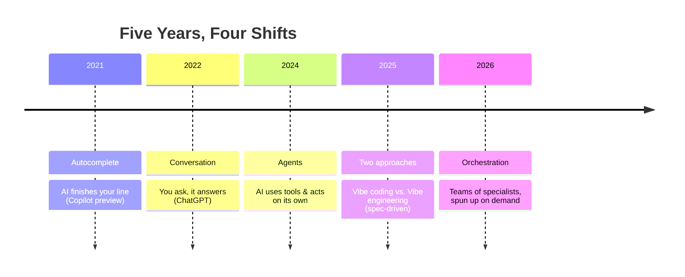
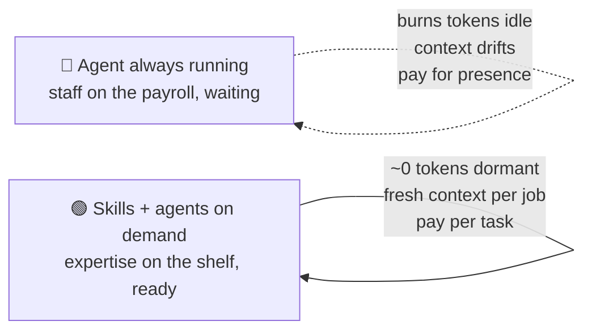
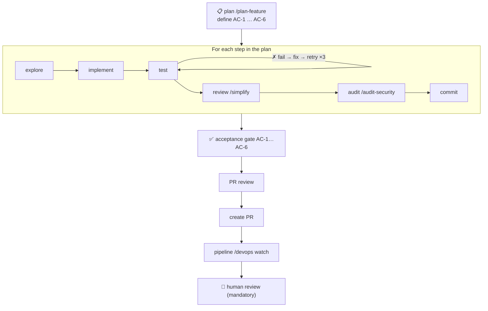

# 🎤 Orchestrated AI Coding

> [!abstract] TL;DR
> The leap from messy AI coding to *trustworthy* AI coding isn't a smarter model — it's **orchestration**: who does what, with which rules, and when to stop. Treat the AI like a **team** (manager + on-call specialists + a handbook + quality gates) instead of a single chatbot you copy-paste from.
>
> **Same models. Different system.**

*Talk @ AI Montreal · by Ho Kai, with Faïçal Sawadogo & Mossab Belle*

> [!info] Why this matters (the motivation)
> In a single long chat, the more you ask, the more the context fills up — the agent **drifts and gets confused** (it'll even fail to find a function it just wrote). Orchestration exists to fight that: small, fresh, scoped jobs instead of one ever-growing conversation.

---

## 01 · The Evolution — five years, four shifts

Each shift moved the human **up one level**: from *typing* → *asking* → *directing* → *designing the system*.



- **Autocomplete** → predicting the next token in your editor
- **Conversation** → a chat loop you drive prompt-by-prompt
- **Agents** → the model can call tools and take multi-step actions
- **Two approaches** → fast "vibe coding" vs. disciplined "vibe engineering"
- **Orchestration** → many small specialists coordinated toward a goal

---

## ⚔️ Without vs. With Orchestration

### ❌ Coding *without* orchestration
> The default loop — one prompt, one agent: *"accept it and move on."*

- **Describe** what you want, in plain language
- **Accept** what the AI gives — don't read the code
- **Iterate** by pasting the error back and trying again

> 🌙 *The speaker's image: it's 2am, "it doesn't work" → you copy the error, paste it, and **pray** the model figures it out.*

🟡 *Fast and frictionless for a prototype — but nobody reads the code, and nothing is verified.*

### ✅ Coding *with* orchestration
> Keep the speed, add the discipline — plan, verify, and know when to stop.

- **Plan first** — work is specified before any code exists
- **Tests & reviews** — every change is verified by machines *and* humans
- **Written rules** — conventions live in files the AI reads every time
- **Honest stopping** — the system knows when to hand back to a human

🟢 *AI still writes the code — humans engineer the system around it.*

### Side by side

| | ❌ Without orchestration | ✅ With orchestration |
|---|---|---|
| **Who reads the code** | nobody | reviewers — human and AI |
| **Where the rules live** | in your head, per prompt | in files, versioned with the repo |
| **When something fails** | paste the error, hope | diagnose · retry · escalate |
| **What ships** | whatever ran last | only what passes every gate |
| **Best for** | prototypes, exploration | production, teams, autonomy |

> [!quote] The core insight
> The gap isn't *intelligence* — it's **orchestration**: who does what, with which rules, and when to stop.

---

## 02 · How It Works

### 🧑‍💼 Think of it as a team
If you can run a team, you already understand multi-agent systems.

| Concept | Team analogy | Role |
|---|---|---|
| **The orchestrator** | the manager | decides who works on what, and when |
| **Skills** | standard procedures | written expertise, on the shelf until needed |
| **Agents** | on-call specialists | spun up for a job, dismissed when done |
| **CLAUDE.md** | the employee handbook | house rules every worker reads on day one |
| **Gates** | quality control | nothing ships until every check passes |

### 📜 A skill is a *contract*, not a prompt
A skill declares **name · scope · tools · context · stopping** — written once, reused forever.

```yaml
name: audit-security
scope: scan for security violations in changed code
tools: read-only (Grep, Read) — never writes
context: isolated session, fresh per run
stopping: report findings, hand fixes back to caller
```

> 🗝️ *Today's clever prompt is tomorrow's deployed skill.*

### 🔋 Always-on vs. on-demand



- **Always-on agent** → burns tokens while idle, context fills with noise, you pay for *presence*
- **On-demand skills** → dormant ≈ 0 tokens, loaded only when invoked, you pay per *task completed*

> Encode the human knowledge in **skills** · spin up the **agent** only when there's work.

> [!tip] How specialists keep context clean
> Rather than one agent reading a 500-page "book" and clogging its memory, each specialist does its job and **hands back a summary**. The next specialist picks up that summary and starts fresh — the heavy context is thrown away, not carried forward. *(Speaker note from the talk.)*

### 🔄 The loop
Each box is a skill the orchestrator invokes — it decides which, when, and how to recover.



- **Phase 0** → define acceptance criteria *before any code*
- **Inner loop** → explore → implement → test → review → audit → commit (retries on failure)
- **Ship gate** → acceptance check → PR → pipeline → **a human must approve before merge**

### ♻️ The session is the unit of work
> *Kill the session, keep the skill — that's the whole trick.*

- **Fresh** — every session starts with a clean, focused context (no drift)
- **Isolated** — parallel sessions can't collide (one repo, separate worktrees)
- **Disposable** — ends when the task ends; nothing keeps running or billing
- **Stateless by design** — knowledge lives in skills + CLAUDE.md, not in memory

---

## 03 · The Rules — three rules make it trustworthy

> [!warning] Trust is engineered, not assumed
> 1. **The gate** — nothing ships until every check passes
>    *(tests · security audit · build — machine-verified)*
> 2. **Stopping** — an agent that won't stop is not deployable
>    *(3 failed attempts → escalate to a human, with full trace)*
> 3. **Human sync points** — automation buys time, it doesn't replace judgment
>    *(escalations, merges and deploys all end at a person)*

### Concrete guardrails (from the Q&A)
- **The agent can only *create* a PR — never *merge* it.** Merging is reserved for a human.
- **3 strikes rule:** if a tool action fails 3 times, the agent **stops and writes it up** (e.g. opens a GitHub issue documenting the problem) instead of plowing ahead.
- **The gate lives at the tests** — unit + integration tests are the machine-verified checkpoint before anything ships.

> [!quote] Why the stop rule exists
> "Give an agent the keys without telling it to stop, and it'll always find a way to keep going." An agent that can't stop is a liability — so stopping is a *designed* behavior, with a full trace handed back.

---

## 04 · The Demo — Gatherly

An event-management app, fully built/maintained through orchestrated agents.
**Stack:** `BE (FastAPI · Python 3.12 · async SQLAlchemy)` · `FE (Next.js 14 · TypeScript · shadcn/ui · i18n en+fr)`
**Repo:** [`github.com/Bmbsolution/genai-demo`](https://github.com/Bmbsolution/genai-demo) — `gatherly-be/` + `gatherly-fe/`, with the whole orchestration setup checked into `.claude/`.

- **Events catalog** — cover, capacity & visibility in one place
- **Insights & readiness** — response rates, capacity & what's still missing
- **Guests & RSVPs** — +1s, dietary, waitlists, check-in, CSV in/out
- **Audit worker** — scans each event · checks readiness · drafts fixes
- **Work-readiness agent** — picks gaps · opens fixes back to your events
- **Free & Pro plans** — usage limits, upgrades & Stripe-ready billing

### Total orchestration — one command does the whole loop

```bash
$ /implement add a "starts_in_future" readiness check \
  that flags events whose start time is already in the past
```

> One slash command kicks off plan → implement → test → review → audit → PR → human review.

> [!check] This exact example is real
> That `starts_in_future` check isn't a hypothetical — it's a **merged PR in the repo**: `feat(insights): add starts_in_future readiness check (severity medium) (#46)`. It lands as one more entry in the event-readiness checklist (a `medium`-severity check), alongside high-severity ones like `has_location`, `has_guests` and `within_capacity`.

**How the demo actually ran:**
- `/implement` = calling the **orchestrator** (the manager). After that one command, *"we have nothing more to say."*
- The orchestrator reads the **workflow file** every time, figures out which skills + agents the task needs, and triggers them.
- Each agent runs in its **own worktree**, color-coded — e.g. one agent implements, another reviews security — and stays inside its box.
- The agent is told to **avoid over-engineering**: know what's well-defined, what matters, and when "enough is enough."

### 🗂️ What's actually checked into the repo

The "team" isn't a framework — it's just files in `.claude/` that every session reads. From [`genai-demo`](https://github.com/Bmbsolution/genai-demo):

- **`CLAUDE.md`** — the handbook (domain model, the security guards, the AC framework, the 3-strikes loop). Read on every session.
- **`WORKFLOW.md`** — the REPL loop + the rule *"Claude never merges."*
- **~18 skills** in `.claude/skills/*/SKILL.md` — each a single contract. The ones named in the talk are all here: `/implement`, `/plan-feature`, `/audit-security`, `/simplify`, `/devops` — plus `/review-pr`, `/create-pr`, `/triage`, and autonomous workers `/work-issues` & `/work-findings`.
- **~5 on-demand sub-agents** in `.claude/agents/` — `code-reviewer`, `security-auditor`, `test-writer`, `frontend-reviewer`, `migration-reviewer`. Read-only specialists, spun up in parallel and dismissed when done.
- **Hooks** in `.claude/settings.json` — e.g. a `PostToolUse` lint hook that runs `ruff` after every edit and pushes violations back to the agent, and a deny-list blocking `rm -rf`, `git push --force`, `--no-verify`, `~/.ssh`, etc.

### ✅ The acceptance gate, concretely (AC-1 … AC-6)

The "AC-1 … AC-6" the orchestrator defines up front are spelled out in `CLAUDE.md`. A feature is blocked until **all six** pass:

| | Criterion | What it means |
|---|---|---|
| **AC-1** | Functional | happy path **and** edge cases work |
| **AC-2** | Tests | ≥ 80% coverage on new code |
| **AC-3** | Security | the guards are present (auth · ownership · RBAC · rate-limit · audit-log) + no raw SQL / secrets |
| **AC-4** | Quality | no duplication; repository/service pattern respected |
| **AC-5** | Lint & build | `ruff` + `mypy --strict` + `pnpm lint/build` clean |
| **AC-6** | Frontend | types from OpenAPI, i18n (en+fr), dark mode, TanStack Query |

> The same checks run again in CI (`.github/workflows/ci.yml`) on every PR to `main` — so the gate is enforced twice: once by the orchestrator, once by the pipeline.

---

## ❓ Q&A highlights

> [!question] "How do you stop an agent from going rogue?" *(the Replit-style horror-story fear)*
> Tight tooling + the **3-strikes** rule. The agent can **only create PRs, not merge**. After 3 failed attempts it halts and documents the issue. Stopping points are mandatory.

> [!question] "How do you coordinate back-end ↔ front-end changes?"
> The **manager keeps minimal context** and routes. It detects whether a task touches BE or FE and dispatches the right specialist with a *ready, scoped* context. E.g. "make the top button red" → recognized as pure front-end → handed to the FE agent. Knowledge of the whole repo lives in the plan + CLAUDE.md, not in one bloated session.

> [!question] "How often do humans intervene in the loop?"
> **Almost never** — even deployment ran clean. Humans stay at the sync points (approve/merge/deploy).

> [!question] "Do you build the whole project at once, or feature by feature?"
> Whole project — **but only after heavily describing it first.** They've spent **~2 days just writing the plan**, because once the plan is solid the whole build flows from it. Tasks are also **broken down** into small pieces so failures stay contained.

---

## 🧠 Takeaways for the channel

- The differentiator in 2026 isn't the model — it's the **system around it**.
- **Skills = reusable contracts.** Promote your good prompts into versioned, scoped skills.
- **Agents are disposable & on-demand** — cheaper and cleaner than one long-running bot.
- **Gates + honest stopping + human sync points** are what make autonomy *trustworthy*.
- Mental model: **you're a manager running a team**, not a user chatting with a bot.
- **The plan is the leverage** — they spent ~2 days writing it so the whole build could run almost hands-off. Invest at the start, then let it run.
- **Guardrails over trust:** agents create PRs but never merge; 3 strikes → stop + document. That's what keeps "9-seconds-to-disaster" stories from happening.

---
*Speaker: Ho Kai — Software Engineer (enterprise software, San Francisco). [LinkedIn](https://www.linkedin.com/in/ho-kai-yip-8285544/)*
*With Faïçal Sawadogo (Manager.js inc) & Mossab Belle (Cloud Architect).*
*Demo repo: [github.com/Bmbsolution/genai-demo](https://github.com/Bmbsolution/genai-demo) — the full `.claude/` orchestration setup (skills, agents, CLAUDE.md, hooks) is checked in.*
