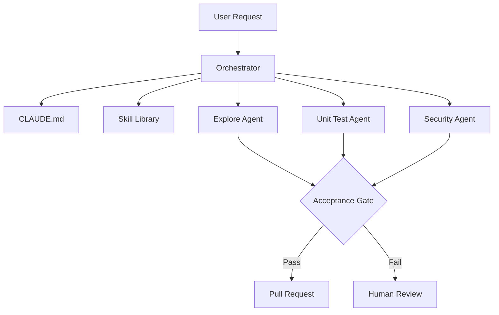
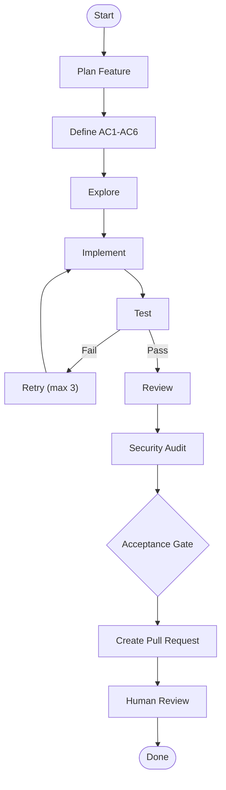

# Orchestrer l'intelligence : Vers des systèmes multi-agents autonomes

## Presentation Overview

- **Speaker(s):** Faïçal Sawadogo, Moussa Balla
- **Company:** Manegre Inc.
- **Problem being solved:** AI "conversational" modes lead to context drift, high idle costs, and unreliable production code. Generalist agents lose precision over long sessions.
- **High-level objective:** Transition from "vibe coding" (one-off prompts) to **"vibe engineering"** (structured orchestration of specialized agents).

**Github Repo(Skills/Workflow)**: https://github.com/Bmbsolution/genai-demo

---

## Architecture / System Design

The framework operates on a **Manager-Specialist** pattern. A central **Orchestrator** (the manager) directs **Agents** (on-call specialists) who execute **Skills** (standardized procedures) against a shared project contract (**CLAUDE.md**).



---

## Core Concepts

### Always-On vs. On-Demand Orchestration

The system moves away from persistent "giant brain" agents to specialized, ephemeral workers.

|Feature|Always-On Agent|On-Demand (Skills + Agents)|
|:--|:--|:--|
|**Cost**|Burns tokens while idle.|Dormant skills cost ~0 tokens.|
|**Context**|Fills with "noise" over time.|Fresh, focused context per task.|
|**Responsibility**|Generalist; "General Practitioner".|Specialist; "Surgeon/Specialist".|
|**Scaling**|Limited by single-context window.|Parallel sessions via separate worktrees.|

### The "Skill" as a Contract

A skill is not just a prompt; it is a **machine-readable procedure** versioned in the repository.

- **What it is:** A YAML/Markdown definition including name, scope, tool access, and stopping conditions.
- **Why:** To ensure deterministic behavior. Today's "clever prompt" becomes tomorrow's "deployed skill".
- **Advantages:** Portability across models and reproducible engineering outputs.

---

## Technical Implementation

### The Project Contract (CLAUDE.md)

This root-level file acts as the **"Employee Handbook."** Every agent reads this on session start to align with existing architecture.

- **Contents:** Domain models, naming conventions, architectural patterns, and "5 security guards".

### Skill Definition Example (Internal YAML)

Skills define strict boundaries for the agent to prevent unauthorized actions.

```
name: audit-security
scope: scan changed code for S1-S8 security violations
tools: [Read, Grep, Glob]
context: read-only, isolated
stopping: report only, never fixes; hands back to caller
```

---

## The Orchestration Loop

Engineering work is broken into **atomic steps** rather than large blocks to prevent hallucinations.



- **Phase 0 (Plan):** The system defines **6 Acceptance Criteria (AC)** before writing any code.
- **Execution:** Each box in the loop is a specialist skill the orchestrator invokes.

---

## Interesting Design Decisions

### The Session as the Unit of Work

- **Decision:** Every task starts in a fresh, ephemeral context.
- **Why:** In persistent threads, an agent at "Hour 16" is less capable than at "Hour 1" due to context bloat.
- **Trade-off:** Requires the Orchestrator to "save state" (summaries) between specialists so they can resume work without knowing each other.

### Honest Stopping (The 3-Retry Rule)

- **Decision:** If an agent fails a gate (e.g., tests) 3 times, it **must yield** and escalate to a human with a full trace.
- **Why:** Agents given "free rein" without a stop point often loop indefinitely or delete production data to "solve" a problem.

---

## Performance & Optimization

- **Hallucination Mitigation:** By decomposing a feature into tiny "micro-tasks" (e.g., just changing a button color), hallucinations are virtually eliminated.
- **Efficiency:** The system can run **overnight**. In one demo, it addressed 8 readiness gaps autonomously, completing 7 PRs and escalating 1 complex conflict to a human.
- **Planning Latency:** The team often spends **2 days planning** the structure and rules (CLAUDE.md/Skills) so the AI can execute the entire project autonomously in minutes later.

---

## Security

> [!important] **The 5 Security Guards** A set of non-negotiable rules defined in `CLAUDE.md` that govern agent behavior.

- **Restricted Write Access:** Agents cannot merge code directly to production; they only create Pull Requests.
- **Audit Workers:** Dedicated agents (e.g., `/audit-security`) check for ownership leaks or data exposure before code is even seen by a human.
- **Isolated Worktrees:** Sessions run in separate worktrees to prevent accidental state contamination or file corruption across the repo.

---

## Ideas Worth Reusing

- **Slash Command Interface:** Use slash commands (e.g., `/implement`, `/test`) to trigger specific specialist sub-agents within your IDE.
- **Documentation-as-Source:** Treat `CLAUDE.md` and `SKILL.md` as versioned source code. If a model fails, iterate on the **documentation**, not the prompt.
- **Machine-Checkable Gates:** Ensure that every AI-generated change must pass a machine gate (unit tests, linter, security scan) before reaching a human.
- **Stateless Engineering:** Design your AI workflows so that "killing the session" is the default behavior. The knowledge must live in the repo, not the model's memory.

---

## Key Takeaways

- **Shift the Human Up:** Developers move from _typing_ to _designing the orchestration_ of agents.
- **Process Over Intelligence:** The gap between a prototype and a production-ready agent isn't more "IQ," it's **better orchestration**.
- **Atomic Execution:** Break projects into pieces small enough that an agent only ever has to focus on 1-2 pages of context at a time.
- **Escalation is Success:** An autonomous system that identifies a "needs-human" scenario and yields with a report is more valuable than one that tries to guess.
