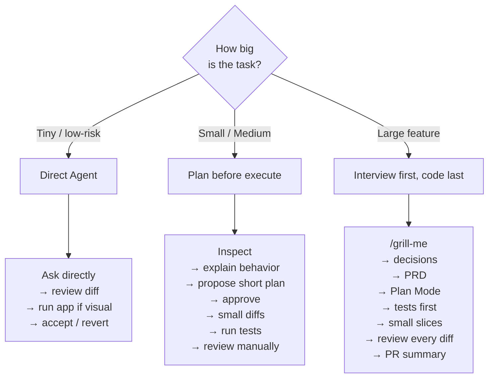

> [!abstract] TL;DR
> AI writes the code now — so the **bottleneck moved** from *typing* to *verifying, understanding and maintaining*. The talk is a practical playbook for treating a coding agent (Cursor, here) as a **multiplier** rather than a magic box: feed it the **right context** (not more context), keep context **below ~40–50%**, configure it with **Rules / Commands / Skills**, wire in **MCP** for live docs, and **match your workflow to the task size** (tiny → just ask; large → start as an *interviewer*, not a coder). The line that ties it together: *"Cursor is the multiplier. Your process decides what gets multiplied."*

> [!quote] Why this matters
> A feature that took two weeks can take a day — but only if you own the engineering lifecycle around the agent. Vibe **coding** ("I asked Cursor to build it") doesn't scale into real systems; vibe **engineering** (clarify → plan → test → review → ship responsibly) does.

---

## 01 · The bottleneck has moved

> [!info] The new reality
> - It's no longer about **generating** code.
> - It's about **verifying, understanding, maintaining, and evolving** it.
> - Engineers who can turn AI output into **reliable systems** will move faster.

| Old world | New world |
|---|---|
| Typing code was slow — **human generation** was the bottleneck | AI makes more code — **verify / maintain** is the bottleneck |

*(speaker note)* The host framed the speaker as a "field engineer / builder" and said what stood out was that he talks about **engineering**, not just the product. The speaker positioned the whole talk as *"vibe coding → vibe engineering"* and said the term *vibe coding* was popularized last year — he attributed it to a name that is **garbled in the recording** (sounds like "Andrew Spivey"; treat the attribution as unverified).

---

## 02 · Software lifecycle still matters

AI can generate code faster, but the lifecycle does **not** disappear:


> [!success] Key takeaway
> AI accelerates **implementation** (step 4). **Engineering owns the lifecycle** — all nine steps.

---

## 03 · Specification: vague prompts create hidden bugs

Cursor may generate something *reasonable* — but reasonable ≠ **correct**.

```text
Prompt:  Given a list of characters, remove duplicates.
Input:   [A, B, A, C, D]
```

| Output A — `[A, B, C, D]` | Output B — `[B, C, D]` |
|---|---|
| Keep one copy of each value (standard dedupe) | Remove **all** values that repeat entirely |

> [!warning] Both are defensible. Only one may be correct **for your use case** — and the model can't read your mind. The spec is your job.

---

## 04 · Feed your agent the right context

Coding-agent quality depends on what you feed it. **Context is not just the open file — it's the entire engineering picture you provide.**

The context window should be fed from: **Architecture docs · Existing patterns · Test coverage · PRD · Constraints · Edge cases.**

| Good context | Bad context |
|---|---|
| Architecture docs, existing patterns, test coverage, PRD, constraints, edge cases | One file, vague intent, no tests, no acceptance criteria |

---

## 05 · Avoid the "context dump zone"

Context is **not free**. When the chat gets too full, quality degrades. Rule of thumb: **keep context below ~40–50%.**

> [!warning] Warning signs you've entered the dump zone
> - The agent **forgets previous decisions**
> - It **repeats the same mistakes**
> - It **edits unrelated files**
> - It **ignores constraints**
> - It gives **generic answers**
> - It becomes **harder to steer**
>
> Once you're in the dump zone, **don't keep pushing — refactor your approach.**

> [!success] Key takeaway
> More context is **not** always better. **Better context is always better.**

*(speaker note)* He showed Cursor's live **token-usage** meter (ticks up ~10% at a time). Personal/project context is often ~**20K–50K** tokens while frontier models allow **>1M** — so monitor it and start fresh well before quality craters. *(reference: the "context window has a dumb zone" article by Bogdan Hadadea, cited on the References slide.)*

---

## 06 · When the agent gets too much context

Two moves:

| Start a new agent | Create a handoff note |
|---|---|
| Use when the topic changed or the thread is polluted | Summarize goal, decisions, files touched, risks, tests, and next step |

```text
Suggested handoff prompt
------------------------
Summarize this session so I can start a fresh agent.
Include the goal, important decisions, files touched, current status,
known risks, and exact next steps. Be concise and do NOT include
irrelevant history.
```

> [!success] Key takeaway
> Starting fresh is **not failure** — it's **context hygiene**.

> [!tip] Grounded in the repo
> This maps to the **`handoff`** skill in `mattpocock/skills` (`skills/productivity/handoff`) — compress a finished agent's context into a short handout (~10% of the content) so the next agent starts clean.

---

## 07 · Pick the right model for the right task

Choose the model by the kind of work: deep thinking, fast execution, or a balanced default. (Pick your favorite vendor — Anthropic / OpenAI / Google.)

| Need | Model tier |
|---|---|
| Planning & deep thinking | **Frontier** models |
| Balanced work | **Composer** (Cursor's balanced model) |
| Execution / mechanical edits | **Fast** models |

> [!info] Simple strategy
> 1. Start with a **higher-cost** model to think, plan, and define the approach.
> 2. **Switch to a cheaper** model to execute efficiently.
> 3. Use a **balanced default** when the task is moderate and you want quality + speed.
>
> *Think expensive models for planning, cheaper models for executing.*

*(speaker note)* He likes keeping a fast/balanced model (Composer) for **high-level vision** so he can "see the whole thing" without burning the frontier model on color tweaks. A garbled aside referenced Cursor's valuation/economics (numbers in the transcript are unreliable — skip).

---

## 08 · Rules, Commands, and Skills — three ways to configure your agent

| | Rules | Commands | Skills |
|---|---|---|---|
| **What** | Persistent guardrails | Manual shortcuts for repeated actions | Reusable expertise loaded when relevant |
| **Role** | Shape **behavior** | **Trigger** actions | Add **capability** |

> [!success] Key takeaway
> **Rules shape behavior. Commands trigger actions. Skills add capability.**

### Rules — context & guardrails
Project-wide or global guidelines. Use rules for: **tech stack details · coding conventions · architecture rules · testing expectations · error-handling style · security constraints.**

```text
Examples:
- Always use TypeScript.
- Never hardcode API keys.
- Prefer existing components.
- All database writes need validation.
- All new API routes need tests.
```
Rules can apply globally, intelligently, or by file type. *(speaker note: put your tech stack and library names in Rules so the agent stops asking and stops guessing — it minimizes context.)*

### Commands — explicit actions
Reusable prompt shortcuts for things you trigger manually:

```text
/grill-me     /plan-feature     /review-diff     /write-tests
/find-risk    /create-pr-summary     /security-check
```
Useful when: you know exactly the workflow you want · you want repeatability · you want less prompt fatigue.

### Skills — autonomous workflows for agents
Use when the agent may need to **decide when and how** to apply a domain-specific process. Why they matter: **reusable process · fewer forgotten steps · team consistency · better agent behavior · less prompt fatigue.**

### Skills vs. Commands

| Commands | Skills |
|---|---|
| Lightweight, **one-shot prompt macros** | **Agent workflows** |
| Run once, return an answer or transformation | Inspect your codebase, make decisions, apply changes across **multiple steps**, iterate or **stop based on confidence** |

> [!tip] Grounded in the repo
> The cited `mattpocock/skills` repo is **skills-only** — it ships `grill-me`, `to-prd`, `implement`, `tdd`, `handoff`, `triage`, and more. **Rules** and **Commands** are agent-config concepts (Cursor / Claude Code), *not* folders in that repo — don't expect to find them there.
>
> The talk's `/grill-me` is real: `skills/productivity/grill-me/SKILL.md` — *"A relentless interview to sharpen a plan or design"* (user-invoked; it kicks off a `/grilling` session).

*(speaker note)* On `/grill-me`: the value is that it asks **only ~2 questions and assumes the rest**, instead of the "ask you 10 questions to produce one PRD" tools. He also keeps **custom skills from prior startup work** that encode a repeatable way to gather information — saves re-prompting the same thing again and again. He stressed skills are **changing constantly**, so there's no definitive answer "as of today."

---

## 09 · MCP: keep agents up to date

A model trained in the past needs **access to the present.** Connect Cursor to: latest framework docs · library documentation · API references · internal docs · ticket context · database schema · design-system docs · product specs.

> [!info] Use MCP when
> - The library **changes often**
> - The model gives **outdated API usage**
> - The task depends on **internal knowledge**
> - The agent needs **external tools or live context**

*(speaker note — Figma anecdote)* A UI designer dumped HTML/CSS exported from Figma. Instead of pasting that, **connect the Figma MCP** and let the agent pull the latest version straight into the editor. He added he "hates reading git history" — let connected sources carry that, not your eyeballs.

---

## 10 · Match the workflow to the task size

> [!info] Not every task deserves the same agent workflow. The engineering skill is **knowing how much structure to add before the agent writes code.**



### Tiny tasks — direct agent is a good start
*Low-risk, local, quick to review.* Examples: change a color · fix spacing · update copy · rename a label.
**Workflow:** ask agent directly → review the diff → run the app if visual → accept or revert. *Ownership still stays with you.*

### Small / medium tasks — plan before execute
Examples: add a small component · fix a real bug · adjust an API route · refactor a module.
**Workflow:** inspect relevant files → explain current behavior → propose a short plan → review & approve → implement in small diffs → run tests → review manually.

> [!warning] Rule: **No plan, no code.**
> Suggested prompt: *"Before editing files, inspect the relevant code and propose a short implementation plan. Include files you will touch, risks, and tests to run. Wait for my approval before coding."*

### Large features — start as an interviewer, not a coder
Large features need **shared understanding · product decisions · technical constraints · acceptance criteria.**

```text
1. Use /grill-me            5. Write tests first
2. Turn ambiguity → decisions   6. Implement in small slices
3. Produce a PRD            7. Review every diff
4. Use Plan Mode           8. Create a PR summary
```

*(speaker note)* For medium work, **always use Plan Mode** — produce a plan/spec first so context isn't lost when coding starts. When something goes wrong, **go back in history** and re-clarify the ambiguous step rather than re-prompting forward into a mess.

---

## 11 · Cursor is constantly updating

| Agent workspace | Product feedback loop | Extensibility | Other |
|---|---|---|---|
| Agents Window · parallel agents · multi-repo workflows · worktrees | Integrated browser · **Design Mode** · local/cloud handoff | Marketplace plugins · skills · MCP · subagents | **Voice Mode** · **Best of N** |

*…and many, many more.*

*(speaker note)* Highlights he called out live:
- **Voice Mode** — talk to Cursor instead of typing (great with headphones; "put it on, talk, come back").
- **Design Mode / integrated browser** — the agent can open the browser, take screenshots, and compare against the design — he found this notably better than Codex's flow.
- **Best of N** — several agents attempt the same task in parallel and **you pick the best result**.
- **Cloud / parallel agents** — he uses parallel agents but was lukewarm on the cloud agent experience ("the cloud's not great, I don't like it" — *speaker opinion*).

---

## 12 · The difference

| Vibe Coding | Vibe Engineering |
|---|---|
| *"I asked Cursor to build it."* | *"I used Cursor to clarify, plan, test, implement in increments, document, review, and ship responsibly."* |

> [!quote] Cursor is the multiplier. **Your process decides what gets multiplied.**

---

## 13 · Closing — the coding agent is the multiplier

> [!quote] Coding Agent is the multiplier.
> Always ask: **what changed? why? how was it tested? what could break?**

*(speaker note)* The closing pitch: don't aim to *build flashy things* — aim to **clarify, document, and review** so you can ship responsibly. That's how a two-week feature becomes a one-day feature. **Become the driver, not part of the machine** — keep growing the spec/context you trust and won't break.

---

## Q&A highlights

> [!question] When does "vibe" stop working?
> *Audience:* It feels great early — "do that thing" gives big results. But deeper in, on **uncommon/specific features**, you end up directing every step, planning diagrams and architecture. How do you think about *"I just want the AI to code faster while I keep the ideas in my head"* vs. handing it detailed specs?
> *Answer:* Even then, **ask the AI to review and spot anything wrong** — keep that interaction in the loop. It comes back to one thing: **context hygiene.** "I use the word *hygiene* for context."

> [!question] MCP vs CLI — don't CLIs use fewer tokens?
> *Answer:* They're **two different uses — I use both** (separation of concern). If you have a **business API online**, wrap it in an **MCP**. If you're doing **DevOps / OS-level tooling**, a **CLI** usually makes more sense and carries good context for tools. There's overlap — **experiment and see what works for you.** *(transcript partly garbled.)*

> [!question] Is the PRD/BRD human-readable, or written by the agent?
> *Answer:* It's **agent-written** and not really meant for cover-to-cover human reading — it lives in the repo root and is readable enough when you go in. Keep it **short**; treat it as somewhat disposable (it may work once and not the second time). Don't block the agent on perfecting it.

> [!question] How do you know the agent actually understood you?
> *Answer:* Have it **tell you back "this is what I heard."** Reading its restatement is where you catch *"whoa — that's not what I said,"* or watch it come together. It also surfaces gaps and **security holes** early — review *before* it happily emits all the code, because it tends to break near the end.

> [!question] How do you avoid waiting on the agent?
> *Answer:* **Specialized agents in parallel** (e.g. one on one area, one on another) so you're not blocked. He manages ~**3–4 in parallel**. The catch: parallel only works with **clearly defined context per agent** so they don't collide on the same files.

---

## Takeaways

- **The bottleneck is verification, not generation** — engineering owns the lifecycle; AI only accelerates implementation.
- **Specs beat vibes** — "reasonable" output isn't "correct" output; pin down the spec.
- **Better context > more context** — keep the window below ~40–50%; watch for the dump-zone warning signs.
- **Context hygiene** — start fresh agents and write handoff notes instead of pushing a polluted thread.
- **Right model for the job** — frontier to plan, fast/Composer to execute.
- **Configure with Rules / Commands / Skills** — guardrails, shortcuts, and reusable workflows.
- **Wire in MCP** — give a past-trained model access to the present (live docs, Figma, schema).
- **Match workflow to task size** — tiny: just ask; medium: *no plan, no code*; large: **interview first** (`/grill-me` → PRD → Plan Mode → tests → small slices).
- **Cursor is the multiplier — your process decides what gets multiplied.**

---

### Footer
- **Speaker:** name unclear in the recording (introduced as a field engineer / builder; thanked the host "Jenny").
- **Event:** AI meetup, Montreal (stage banner reads "AI MONTREAL").
- **Cited links (from the References slide):**
  - https://www.aihero.dev/
  - https://github.com/mattpocock/skills/blob/main/skills/productivity/grill-me/SKILL.md — the `/grill-me` skill
  - LinkedIn: *"The context window has a 'dumb zone' — here's how to stay out"* (Bogdan Hadadea)
  - Also listed: Prompting guide · Text-generation best practices · Prompt engineering for productivity · Prompt Engineering Guide · ChatGPT Prompt Engineering for Developers · OpenAI Cookbook
- **Referenced repo:** `mattpocock/skills` — https://github.com/mattpocock/skills *(cited for `grill-me`; not the speaker's own project)*
